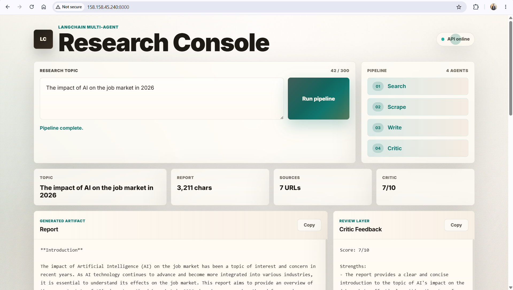
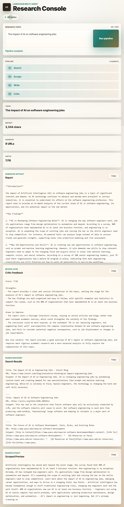
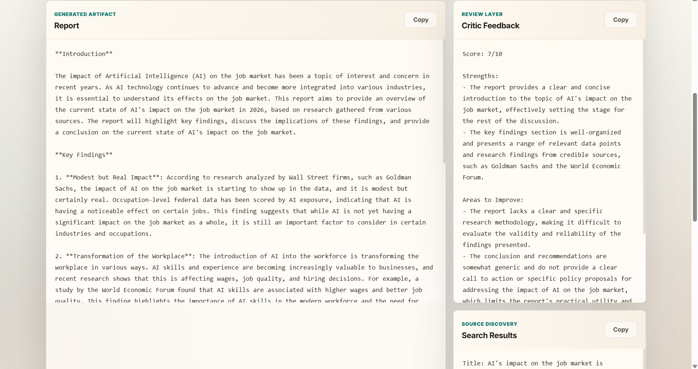
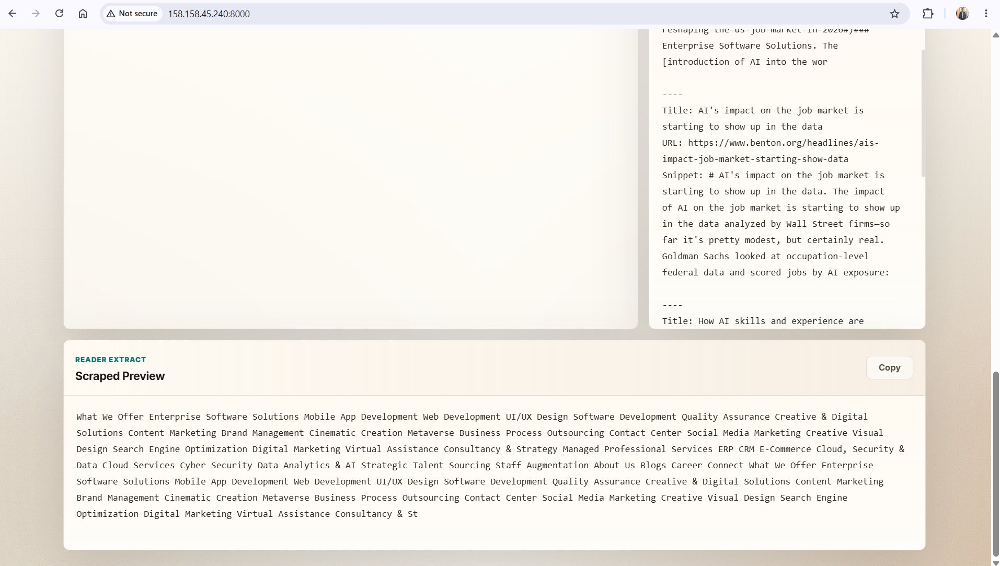
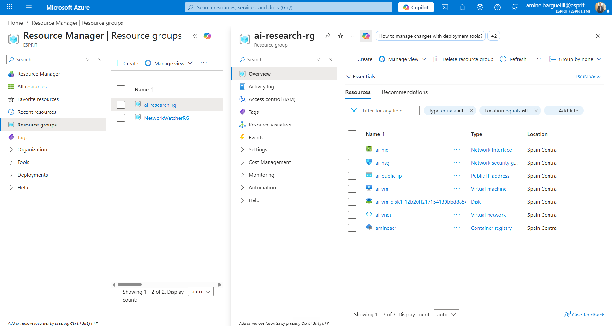
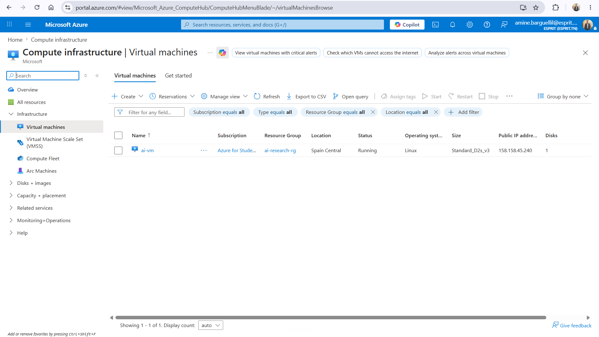
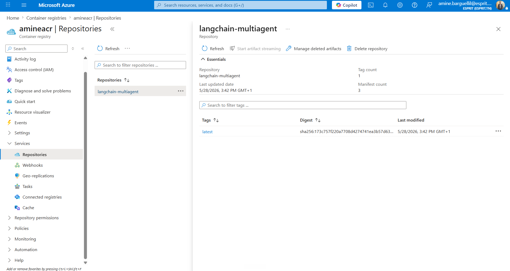

# LangChain Multi-Agent Orchestrator

> *A production-ready AI research pipeline deployed on Azure — from local script to cloud-hosted API.*

---

## Project Overview

> *Four-stage deployment journey: API layer → Docker container → Azure VM → Ansible automation.*

This project turns a local LangChain multi-agent research pipeline into a deployable FastAPI application. The app accepts a research topic, searches the web with Tavily, scrapes a useful source, generates a structured report with Groq, and returns critic feedback through an API and a small browser UI.

The deployment journey followed four main steps:

1. **FastAPI API layer** — *Convert the local AI pipeline into a deployable web API.*
2. **Dockerize the app** — *Package the API, frontend, and dependencies into a portable container.*
3. **Azure VM with Terraform** — *Provision repeatable, version-controlled cloud infrastructure.*
4. **Deploy with Ansible** — *Automate server setup and container deployment end-to-end.*

---

## Step 1 — FastAPI API Layer

> *Wraps the local multi-agent pipeline in a web service accessible via HTTP.*

The first step was to wrap the local AI pipeline in a FastAPI application so it could run as a web service instead of only as a local script.

The FastAPI layer is defined in `app.py` and connects to the pipeline in `src/pipelines/pipeline.py`.

### Main API Routes

> *Three endpoints: UI serving, health monitoring, and the core research pipeline.*

- `GET /` — *Serves the browser UI from `frontend/index.html`.*
- `GET /health` — *Checks that the API is running.*
- `POST /research` — *Runs the multi-agent research pipeline for a submitted topic.*

### Request Format

> *Send a JSON body with the research topic string.*

The `POST /research` endpoint accepts:

```json
{
  "topic": "latest trends in AI agents"
}
```

### Response Fields

> *Five fields returned: topic, search results, scraped preview, report, and critic feedback.*

- the submitted topic
- Tavily search results
- a scraped content preview
- the generated research report
- critic feedback on the report

### Run Locally

> *Install dependencies and start the development server with hot-reload.*

```powershell
pip install -r requirements.txt
uvicorn app:app --reload
```

Open the app at:

```text
http://127.0.0.1:8000
```

### Browser UI — Research Console

> *The frontend shows the pipeline status, generated report, critic score, search results, and scraped preview.*


*Research Console — full pipeline view with topic input, 4-agent pipeline, and result stats.*


*Mobile-responsive view of the Research Console running on the deployed Azure VM.*


*Generated artifact (report) alongside the critic's structured feedback with score and improvement areas.*


*Source discovery section showing Tavily search results and the scraped page preview.*

---

## Step 2 — Dockerize the App

> *Packages the application into a container for consistent, portable deployment.*

The second step was to containerize the FastAPI application with Docker so it can run consistently on any machine or server.

### What the Dockerfile Does

> *Minimal Python 3.11 image, dependency install, file copy, port exposure, and Uvicorn startup.*

- uses `python:3.11-slim` as the base image
- sets `/app` as the working directory
- installs system dependencies
- installs Python packages from `requirements.txt`
- copies the project files into the image
- exposes port `8000`
- starts the API with Uvicorn

### Build and Run

> *Build the image once, run it anywhere using environment variables from `.env`.*

```powershell
docker build -t langchain-multiagent-orchestrator .
```

```powershell
docker run --env-file .env -p 8000:8000 langchain-multiagent-orchestrator
```

```text
http://localhost:8000
```

### Required Environment Variables

> *Two API keys needed: one for Tavily web search, one for Groq LLM inference.*

```text
TAVILY_API_KEY=your_tavily_key
GROQ_API_KEY=your_groq_key
```

---

## Step 3 — Azure VM with Terraform

> *Provisions all cloud infrastructure as code — repeatable and version-controlled.*

The third step was to create the cloud infrastructure using Terraform, so the server setup is repeatable and version-controlled.

The Terraform configuration is stored in the `terraform/` directory.

### What Terraform Provisions

> *A complete Azure networking and compute stack, locked down with SSH and API port rules.*

- an Azure resource group
- a virtual network
- a subnet
- a static public IP
- a network security group
- inbound SSH access on port `22`
- inbound FastAPI access on port `8000`
- a network interface
- an Ubuntu 22.04 Linux virtual machine

### Azure Resource Group

> *The `ai-research-rg` resource group contains all 7 provisioned resources in Spain Central.*


*Resource group overview — NIC, NSG, public IP, VM, disk, VNet, and Container Registry all provisioned together.*

### Azure Virtual Machine

> *A Standard_D2s_v3 Ubuntu Linux VM running in Spain Central with a static public IP.*


*Virtual machines view — `ai-vm` is running with public IP `158.158.45.240`.*

### Run Terraform

> *Initialize providers, preview the plan, then apply to create the infrastructure.*

```powershell
cd terraform
terraform init
terraform plan
terraform apply
```

### Get the Public IP

> *The output IP is used for SSH access, Ansible inventory, and API access.*

```powershell
terraform output public_ip
```

---

## Step 4 — Deploy with Ansible

> *Automates every server setup task and container deployment in a single playbook run.*

The final step was to use Ansible to automate the server setup and deploy the Dockerized app.

The Ansible files are stored in the `ansible/` directory:

- `ansible/inventory.ini` — *Defines the target host group.*
- `ansible/playbook.yml` — *Contains all deployment tasks.*

### Azure Container Registry

> *The Docker image is pushed to Azure Container Registry (`amineacr`) and pulled by Ansible at deploy time.*


*Container registry `amineacr` with the `langchain-multiagent` repository — tagged `latest`, last updated 5/28/2026.*

### Inventory Configuration

> *Currently configured for local execution; swap `localhost` for your VM IP for remote deployment.*

```ini
[local]
localhost ansible_connection=local
```

### What Ansible Automates

> *Full server lifecycle: Docker install → ACR login → image pull → container replacement → run.*

- update apt packages
- install Docker
- start and enable the Docker service
- log in to Azure Container Registry using credentials from `.env`
- pull the image from `amineacr.azurecr.io`
- remove the old `langchain-api` container if it already exists
- run the FastAPI container on port `8000`

### Playbook Variables

> *ACR registry URL and image name used across all deployment tasks.*

```yaml
acr_registry: "amineacr.azurecr.io"
image_name: "langchain-multiagent:latest"
```

### Required `.env` Values for Deployment

> *Four secrets required: ACR credentials for image pull, API keys for runtime.*

```text
ACR_USERNAME=your_acr_username
ACR_PASSWORD=your_acr_password
TAVILY_API_KEY=your_tavily_key
GROQ_API_KEY=your_groq_key
```

### Run the Playbook

> *Run from the project root so the `.env` file is available to the playbook.*

```powershell
ansible-playbook -i ansible/inventory.ini ansible/playbook.yml
```

### Access the Deployed App

> *Replace `<azure-vm-public-ip>` with the IP from `terraform output public_ip`.*

```text
http://<azure-vm-public-ip>:8000
```

```text
http://<azure-vm-public-ip>:8000/health
```

---

## End-to-End Flow

> *User input flows through four agents: search → scrape → write → critique.*

```text
User Topic
  -> FastAPI /research endpoint
  -> LangChain search agent
  -> Tavily web search
  -> URL scraping and content extraction
  -> Writer agent generates report
  -> Critic agent reviews report
  -> API returns report and feedback
```

---

## Tech Stack

> *Python-based AI pipeline served via FastAPI, containerized with Docker, and deployed on Azure using IaC tools.*

| Layer | Technology |
|---|---|
| Language | Python |
| API Framework | FastAPI |
| AI Orchestration | LangChain |
| LLM Inference | Groq |
| Web Search | Tavily |
| HTML Parsing | BeautifulSoup, Trafilatura |
| Containerization | Docker |
| Infrastructure | Terraform |
| Cloud Compute | Azure VM |
| Deployment Automation | Ansible |

---

## Useful Commands

> *Quick reference for local dev, Docker, Terraform, and Ansible workflows.*

### Local API

> *Starts the FastAPI server with auto-reload on code changes.*

```powershell
uvicorn app:app --reload
```

### Docker Build

> *Builds the container image with all dependencies baked in.*

```powershell
docker build -t langchain-multiagent-orchestrator .
```

### Docker Run

> *Runs the container with environment variables injected from `.env`.*

```powershell
docker run --env-file .env -p 8000:8000 langchain-multiagent-orchestrator
```

### Terraform Deploy

> *Initializes and applies the full Azure infrastructure stack.*

```powershell
cd terraform
terraform init
terraform apply
```

### Ansible Deploy

> *Runs the full deployment playbook against the configured inventory.*

```powershell
ansible-playbook -i ansible/inventory.ini ansible/playbook.yml
```